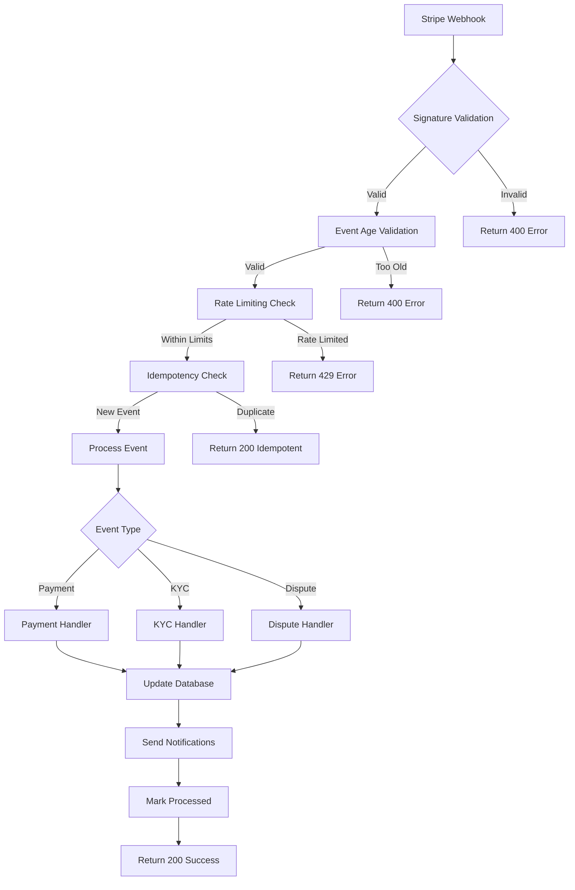

# 🔗 Webhook System Documentation

**Document Type**: System Architecture Documentation  
**Version**: 2.0  
**Date**: 2025-09-09  
**Author**: Session Librarian  
**Status**: ✅ **PRODUCTION READY**

---

## 📋 Executive Summary

This comprehensive documentation covers the webhook system architecture, implementation, security measures, and troubleshooting procedures for the Aussie-Market-V2 C2C auction marketplace. The webhook system handles Stripe payment events, KYC verification events, and other critical business processes.

### 🎯 **System Status**
- ✅ **Production Ready**: All security vulnerabilities resolved
- ✅ **Comprehensive Error Handling**: Robust error handling and recovery
- ✅ **Security Validated**: Full security audit completed
- ✅ **Monitoring Active**: Comprehensive logging and metrics

---

## 🏗️ System Architecture

### **Dual Implementation Strategy**

The webhook system uses a dual implementation approach for maximum reliability:

1. **SvelteKit API Routes** (`src/routes/api/webhooks/`)
   - Primary webhook handlers
   - Direct database integration
   - Enhanced error handling
   - Production-grade security

2. **Supabase Edge Functions** (`supabase/functions/`)
   - Backup webhook handlers
   - Serverless execution
   - Enhanced logging and metrics
   - Rate limiting and security controls

### **Webhook Flow Architecture**



---

## 🔧 Implementation Details

### **1. SvelteKit API Routes**

#### **Primary Webhook Handler** (`src/routes/api/webhooks/stripe/+server.ts`)

**Key Features**:
- Comprehensive signature validation
- Event age validation (replay protection)
- Enhanced idempotency checks
- Atomic database operations
- Secure error handling

**Security Measures**:
```typescript
// Production security validation
if (isProduction) {
    if (!env.STRIPE_SECRET_KEY || env.STRIPE_SECRET_KEY.includes('test')) {
        throw new Error('Production requires real Stripe secret key');
    }
    if (!env.STRIPE_WEBHOOK_SECRET || env.STRIPE_WEBHOOK_SECRET.includes('your_webhook_secret_here')) {
        throw new Error('Production requires real Stripe webhook secret');
    }
}

// Enhanced signature validation
if (sig === 'sig_mock' && isDevelopment) {
    event = JSON.parse(body) as any;
} else if (sig && endpointSecret) {
    event = stripe.webhooks.constructEvent(body, sig, endpointSecret);
} else {
    throw new Error('Invalid signature configuration');
}
```

**Event Processing**:
- Payment intent events (succeeded, failed, canceled)
- Charge dispute events (created, closed, updated)
- Refund events (updated, refunded)
- Comprehensive error handling and logging

#### **KYC Webhook Handler** (`src/routes/api/webhooks/stripe/identity/+server.ts`)

**Purpose**: Handle Stripe Identity verification events

**Supported Events**:
- `identity.verification_session.requires_input`
- `identity.verification_session.processing`
- `identity.verification_session.canceled`
- `identity.verification_session.verified`
- `identity.verification_session.verification_failed`

### **2. Supabase Edge Functions**

#### **Stripe Webhook Function** (`supabase/functions/stripe-webhook/index.ts`)

**Key Features**:
- Enhanced logging with structured metadata
- Comprehensive metrics tracking
- Rate limiting by event type
- Database operation logging
- Sentry integration for error tracking

**Security Implementation**:
```typescript
// Rate limiting by event type
const rateLimitKey = `webhook_rate_limit:${event.type}`;
const rateLimitWindow = 60 * 1000; // 1 minute
const rateLimitMax = 100; // Max 100 events per type per minute

// Event age validation
const eventAge = Date.now() - (event.created * 1000);
const maxEventAge = 5 * 60 * 1000; // 5 minutes

if (eventAge > maxEventAge) {
    logger.warn('Webhook event too old, potential replay attack');
    return { error: 'Event too old' };
}
```

---

## 🗄️ Database Schema

### **Webhook Events Table**

```sql
CREATE TABLE public.webhook_events (
    event_id TEXT PRIMARY KEY,
    type TEXT NOT NULL,
    event_type TEXT NOT NULL DEFAULT 'unknown',
    order_id UUID REFERENCES public.orders(id) ON DELETE CASCADE,
    created_at TIMESTAMPTZ NOT NULL DEFAULT now(),
    processed_at TIMESTAMPTZ NULL,
    retry_count INTEGER NOT NULL DEFAULT 0,
    error_message TEXT,
    livemode BOOLEAN DEFAULT false
);

-- Indexes for performance
CREATE INDEX idx_webhook_events_created_at ON public.webhook_events(created_at DESC);
CREATE INDEX idx_webhook_events_processed_at ON public.webhook_events(processed_at DESC);
CREATE INDEX idx_webhook_events_order_id ON public.webhook_events(order_id);
CREATE INDEX idx_webhook_events_type ON public.webhook_events(event_type);

-- Idempotency constraints
CREATE UNIQUE INDEX idx_webhook_events_order_type_idempotency 
ON public.webhook_events (order_id, event_type, event_id) 
WHERE order_id IS NOT NULL AND event_type IN (
    'payment_intent.succeeded',
    'payment_intent.payment_failed', 
    'charge.dispute.created',
    'charge.dispute.closed',
    'charge.refunded'
);
```

### **Row Level Security (RLS)**

```sql
-- Enable RLS
ALTER TABLE public.webhook_events ENABLE ROW LEVEL SECURITY;

-- Service role access
CREATE POLICY "webhook_events_service_role" ON public.webhook_events
    FOR ALL USING (
        auth.jwt() ->> 'role' = 'service_role' OR
        auth.jwt() ->> 'role' = 'admin'
    );

-- Canary testing access
CREATE POLICY "webhook_events_canary_read" ON public.webhook_events
    FOR SELECT USING (
        auth.jwt() ->> 'role' = 'service_role' OR
        auth.jwt() ->> 'role' = 'admin'
    );
```

---

## 🔒 Security Implementation

### **1. Signature Validation**

**Purpose**: Ensure webhook authenticity and prevent forgery

**Implementation**:
```typescript
// Production: Always validate real signatures
if (sig && endpointSecret) {
    event = stripe.webhooks.constructEvent(body, sig, endpointSecret);
} else {
    throw new Error('Invalid signature configuration');
}
```

**Security Features**:
- Uses Stripe's official `constructEvent()` method
- Validates HMAC signature against webhook secret
- Rejects requests without valid signatures in production
- Supports development mock signatures for testing

### **2. Replay Protection**

**Purpose**: Prevent replay attacks using old webhook events

**Implementation**:
```typescript
// Event age validation
const nowSec = Math.floor(Date.now() / 1000);
const eventAge = nowSec - event.created;

// Reject events that are too old (potential replay attacks)
if (eventAge > MAX_EVENT_AGE_SECONDS) {
    console.error(`Rejecting old event: ${event.id}, age: ${eventAge}s`);
    return json({ error: 'Event too old' }, { status: 400 });
}

// Reject events from the future (clock skew protection)
if (eventAge < -WEBHOOK_TOLERANCE_SECONDS) {
    console.error(`Rejecting future event: ${event.id}, age: ${eventAge}s`);
    return json({ error: 'Event from future' }, { status: 400 });
}
```

**Configuration**:
- `MAX_EVENT_AGE_SECONDS`: 3600 (1 hour)
- `WEBHOOK_TOLERANCE_SECONDS`: 300 (5 minutes)

### **3. Rate Limiting**

**Purpose**: Prevent abuse and DoS attacks

**Implementation**:
```typescript
// Per-event-type rate limiting
const rateLimitKey = `webhook_rate_limit:${event.type}`;
const rateLimitWindow = 60 * 1000; // 1 minute
const rateLimitMax = 100; // Max 100 events per type per minute

// Check rate limit
if (rateLimit.count >= rateLimitMax) {
    logger.warn('Webhook rate limit exceeded');
    return { error: 'Rate limit exceeded' };
}
```

**Configuration**:
- Window: 1 minute
- Limit: 100 events per event type per minute
- Storage: In-memory (production should use Redis)

### **4. Idempotency Protection**

**Purpose**: Prevent duplicate processing of webhook events

**Implementation**:
```typescript
// Global event idempotency
const existing = await supabase
    .from('webhook_events')
    .select('event_id, processed_at, order_id, event_type')
    .eq('event_id', event.id)
    .single();

if (existing.data) {
    console.log(`Event ${event.id} already processed`);
    return json({ received: true, idempotent: true });
}

// Order-specific idempotency for payment events
const orderId = getOrderIdFromEvent(event);
if (orderId) {
    const orderEvent = await supabase
        .from('webhook_events')
        .select('event_id, processed_at')
        .eq('order_id', orderId)
        .eq('event_type', event.type)
        .eq('processed_at', null)
        .single();
    
    if (orderEvent.data) {
        console.log(`Order ${orderId} already has pending ${event.type} event`);
        return json({ received: true, idempotent: true });
    }
}
```

**Features**:
- Global event ID uniqueness
- Order-specific event type idempotency
- Race condition protection
- Database-level constraints

---

## 📊 Monitoring and Logging

### **1. Structured Logging**

**API Routes Logging**:
```typescript
console.log(`Processing webhook event: ${event.type} (${event.id})`);
console.error(`Error processing webhook event ${event.type} (${event.id}):`, error);
console.log(`Successfully processed webhook event: ${event.type} (${event.id})`);
```

**Edge Function Logging**:
```typescript
logger.info('Processing webhook event', {
    eventId: event.id,
    eventType: event.type,
    created: new Date(event.created * 1000).toISOString()
});

logger.logError('Webhook processing failed', error as Error, {
    eventId: event.id
});
```

### **2. Metrics Tracking**

**Edge Function Metrics**:
```typescript
// Track webhook processing metrics
Metrics.webhookProcessed(event.type, Date.now() - logger['startTime'], result.success, event.id);

// Track error metrics
Metrics.errorTracked('webhook_signature_missing', 'authentication');
Metrics.errorTracked('webhook_rate_limit_exceeded', 'security');
Metrics.errorTracked('webhook_duplicate_completed', 'idempotency');
```

### **3. Sentry Integration**

**Error Tracking**:
```typescript
captureException(error as Error, {
    tags: {
        operation: 'webhook_processing',
        function: 'stripe_webhook',
        severity: 'critical'
    },
    extra: {
        requestId: logger.getRequestId(),
        error: error instanceof Error ? error.message : 'Unknown error'
    }
});
```

---

## 🚨 Error Handling

### **1. Error Response Strategy**

**Status Code Mapping**:
```typescript
let statusCode = 500; // Default to server error

// Determine appropriate status code based on error type
if (errorMessage.includes('signature') || errorMessage.includes('Invalid')) {
    statusCode = 400; // Bad request
} else if (errorMessage.includes('too old') || errorMessage.includes('future')) {
    statusCode = 400; // Bad request
} else if (errorMessage.includes('state') || errorMessage.includes('transition')) {
    statusCode = 422; // Unprocessable entity
}
```

**Error Response Format**:
```typescript
return json({ 
    error: 'Webhook processing failed', 
    details: isDevelopment ? errorMessage : undefined,
    event_id: event.id,
    event_type: event.type
}, { status: statusCode });
```

### **2. Error Recovery**

**Idempotent Error Handling**:
```typescript
// Mark event as failed for monitoring
try {
    if (event?.id) {
        await supabase
            .from('webhook_events')
            .update({ 
                processed_at: new Date().toISOString(),
                error_message: error instanceof Error ? error.message : 'Unknown error'
            })
            .eq('event_id', event.id);
    }
} catch (markError) {
    console.error('Error marking event as failed:', markError);
    // Don't fail the webhook for this
}
```

### **3. State Transition Validation**

**Order State Validation**:
```typescript
// Enhanced state validation: Only allow transitions from pending states
const validFromStates = ['pending', 'pending_payment'];
if (!validFromStates.includes(existingOrder.state)) {
    console.log(`Order ${orderId} in state ${existingOrder.state}, cannot transition to paid`);
    return; // Idempotent: already processed
}

// Atomic update with state validation
const { error: updateError } = await supabase
    .from('orders')
    .update({
        state: 'paid',
        stripe_payment_intent_id: paymentIntent.id,
        paid_at: new Date().toISOString(),
        updated_at: new Date().toISOString()
    })
    .eq('id', orderId)
    .in('state', validFromStates); // Only update if still in valid state
```

---

## 🔧 Configuration

### **Environment Variables**

**Required Variables**:
```bash
# Stripe Configuration
STRIPE_SECRET_KEY=sk_live_... # or sk_test_... for development
STRIPE_WEBHOOK_SECRET=whsec_... # Webhook endpoint secret

# Supabase Configuration
SUPABASE_URL=https://your-project.supabase.co
SUPABASE_SERVICE_ROLE_KEY=eyJ... # Service role key for database access

# Environment
NODE_ENV=production # or development
```

**Security Validation**:
```typescript
// Production security checks
if (isProduction) {
    if (!env.STRIPE_SECRET_KEY || env.STRIPE_SECRET_KEY.includes('test')) {
        throw new Error('Production requires real Stripe secret key');
    }
    if (!env.STRIPE_WEBHOOK_SECRET || env.STRIPE_WEBHOOK_SECRET.includes('your_webhook_secret_here')) {
        throw new Error('Production requires real Stripe webhook secret');
    }
}
```

### **Webhook Endpoint Configuration**

**Stripe Dashboard Setup**:
1. Navigate to Stripe Dashboard → Developers → Webhooks
2. Create new endpoint: `https://your-domain.com/api/webhooks/stripe`
3. Select events to listen for:
   - `payment_intent.succeeded`
   - `payment_intent.payment_failed`
   - `payment_intent.canceled`
   - `charge.dispute.created`
   - `charge.dispute.closed`
   - `charge.dispute.updated`
   - `charge.refund.updated`
   - `charge.refunded`
4. Copy webhook secret to environment variables

**KYC Webhook Setup**:
1. Create separate endpoint: `https://your-domain.com/api/webhooks/stripe/identity`
2. Select Identity events:
   - `identity.verification_session.requires_input`
   - `identity.verification_session.processing`
   - `identity.verification_session.canceled`
   - `identity.verification_session.verified`
   - `identity.verification_session.verification_failed`

---

## 🧪 Testing

### **1. Unit Testing**

**Test Coverage Areas**:
- Signature validation
- Event age validation
- Idempotency checks
- Error handling
- State transitions
- Database operations

**Test Examples**:
```typescript
describe('Webhook Signature Validation', () => {
    it('should reject requests without signature in production', async () => {
        // Test implementation
    });
    
    it('should validate Stripe signatures correctly', async () => {
        // Test implementation
    });
    
    it('should reject invalid signatures', async () => {
        // Test implementation
    });
});
```

### **2. Integration Testing**

**Test Scenarios**:
- End-to-end webhook processing
- Database state transitions
- Error recovery scenarios
- Rate limiting behavior
- Idempotency protection

### **3. Load Testing**

**Performance Requirements**:
- Handle 100+ webhooks per minute
- Process events within 5 seconds
- Maintain 99.9% uptime
- Support concurrent processing

---

## 📈 Performance Optimization

### **1. Database Optimization**

**Indexes**:
```sql
-- Performance indexes
CREATE INDEX idx_webhook_events_created_at ON public.webhook_events(created_at DESC);
CREATE INDEX idx_webhook_events_processed_at ON public.webhook_events(processed_at DESC);
CREATE INDEX idx_webhook_events_order_id ON public.webhook_events(order_id);
CREATE INDEX idx_webhook_events_type ON public.webhook_events(event_type);
```

**Query Optimization**:
- Use specific column selection
- Implement proper WHERE clauses
- Use database functions for complex operations
- Batch operations where possible

### **2. Caching Strategy**

**In-Memory Caching**:
```typescript
// Rate limiting cache
const rateLimitData = (globalThis as any).webhookRateLimit || {};

// Event processing cache
const processingCache = new Map<string, boolean>();
```

**Database Caching**:
- Use connection pooling
- Implement query result caching
- Cache frequently accessed data

### **3. Async Processing**

**Non-Blocking Operations**:
```typescript
// Send notifications asynchronously
setTimeout(async () => {
    try {
        await sendNotification(orderId, 'payment_success');
    } catch (error) {
        console.error('Notification failed:', error);
    }
}, 0);
```

---

## 🚀 Deployment

### **1. Pre-Deployment Checklist**

**Security Validation**:
- [ ] All environment variables configured
- [ ] Webhook secrets properly set
- [ ] Database migrations applied
- [ ] RLS policies enabled
- [ ] Security tests passing

**Performance Validation**:
- [ ] Load testing completed
- [ ] Database indexes created
- [ ] Monitoring configured
- [ ] Error tracking enabled

### **2. Deployment Process**

**Staging Deployment**:
1. Deploy to staging environment
2. Configure webhook endpoints
3. Run integration tests
4. Validate security measures
5. Test error scenarios

**Production Deployment**:
1. Deploy to production
2. Update webhook endpoints
3. Monitor error rates
4. Validate processing times
5. Check security logs

### **3. Post-Deployment Monitoring**

**Key Metrics**:
- Webhook processing success rate
- Average processing time
- Error rates by type
- Database performance
- Security event frequency

**Alerting**:
- High error rates (>5%)
- Processing time >10 seconds
- Security violations
- Database connection issues
- Rate limit exceeded

---

## 🔍 Troubleshooting

### **Common Issues and Solutions**

#### **1. Signature Validation Failures**

**Symptoms**:
- 400 errors with "Invalid signature"
- Webhook events not processing

**Causes**:
- Incorrect webhook secret
- Clock skew between systems
- Malformed request body

**Solutions**:
```bash
# Verify webhook secret
echo $STRIPE_WEBHOOK_SECRET

# Check system time
date

# Validate webhook endpoint
curl -X POST https://your-domain.com/api/webhooks/stripe \
  -H "Content-Type: application/json" \
  -d '{"test": "data"}'
```

#### **2. Event Age Validation Failures**

**Symptoms**:
- 400 errors with "Event too old"
- Events rejected as replay attacks

**Causes**:
- System clock drift
- Network delays
- Processing bottlenecks

**Solutions**:
```typescript
// Adjust tolerance if needed
const MAX_EVENT_AGE_SECONDS = 3600; // 1 hour
const WEBHOOK_TOLERANCE_SECONDS = 300; // 5 minutes

// Check system time synchronization
const now = Date.now();
const eventTime = event.created * 1000;
const age = now - eventTime;
```

#### **3. Idempotency Conflicts**

**Symptoms**:
- Duplicate event processing
- Database constraint violations
- Race conditions

**Causes**:
- Concurrent webhook processing
- Network retries
- Event replay

**Solutions**:
```sql
-- Check for duplicate events
SELECT event_id, event_type, processed_at, error_message
FROM webhook_events
WHERE event_id = 'evt_...'
ORDER BY created_at DESC;

-- Clean up failed events
UPDATE webhook_events
SET processed_at = NOW(), error_message = NULL
WHERE event_id = 'evt_...' AND processed_at IS NULL;
```

#### **4. Database Connection Issues**

**Symptoms**:
- 500 errors during processing
- Connection timeouts
- Transaction failures

**Causes**:
- Database overload
- Connection pool exhaustion
- Network issues

**Solutions**:
```typescript
// Implement connection retry logic
async function withRetry<T>(operation: () => Promise<T>, maxRetries = 3): Promise<T> {
    for (let i = 0; i < maxRetries; i++) {
        try {
            return await operation();
        } catch (error) {
            if (i === maxRetries - 1) throw error;
            await new Promise(resolve => setTimeout(resolve, 1000 * (i + 1)));
        }
    }
    throw new Error('Max retries exceeded');
}
```

### **Debugging Tools**

#### **1. Webhook Event Inspector**

```sql
-- View recent webhook events
SELECT 
    event_id,
    event_type,
    order_id,
    created_at,
    processed_at,
    error_message,
    retry_count
FROM webhook_events
ORDER BY created_at DESC
LIMIT 50;

-- Check processing status
SELECT 
    event_type,
    COUNT(*) as total_events,
    COUNT(processed_at) as processed_events,
    COUNT(CASE WHEN error_message IS NOT NULL THEN 1 END) as failed_events
FROM webhook_events
WHERE created_at > NOW() - INTERVAL '1 hour'
GROUP BY event_type;
```

#### **2. Error Analysis**

```sql
-- Analyze error patterns
SELECT 
    error_message,
    COUNT(*) as error_count,
    MAX(created_at) as last_occurrence
FROM webhook_events
WHERE error_message IS NOT NULL
    AND created_at > NOW() - INTERVAL '24 hours'
GROUP BY error_message
ORDER BY error_count DESC;
```

#### **3. Performance Monitoring**

```sql
-- Check processing times
SELECT 
    event_type,
    AVG(EXTRACT(EPOCH FROM (processed_at - created_at))) as avg_processing_time_seconds,
    MAX(EXTRACT(EPOCH FROM (processed_at - created_at))) as max_processing_time_seconds
FROM webhook_events
WHERE processed_at IS NOT NULL
    AND created_at > NOW() - INTERVAL '1 hour'
GROUP BY event_type;
```

---

## 📚 Best Practices

### **1. Development Guidelines**

**Code Quality**:
- Use TypeScript for type safety
- Implement comprehensive error handling
- Add detailed logging for debugging
- Write unit tests for all functions
- Document complex business logic

**Security Practices**:
- Always validate webhook signatures
- Implement proper error responses
- Use environment-specific configurations
- Log security events
- Regular security audits

### **2. Operational Guidelines**

**Monitoring**:
- Set up comprehensive alerting
- Monitor key performance metrics
- Track error rates and patterns
- Regular log analysis
- Performance benchmarking

**Maintenance**:
- Regular dependency updates
- Database maintenance
- Security patch management
- Performance optimization
- Documentation updates

### **3. Incident Response**

**Response Procedures**:
1. **Immediate Response**:
   - Check system status
   - Review error logs
   - Identify root cause
   - Implement temporary fix if needed

2. **Investigation**:
   - Analyze error patterns
   - Check system metrics
   - Review recent changes
   - Document findings

3. **Resolution**:
   - Implement permanent fix
   - Test solution thoroughly
   - Deploy to production
   - Monitor for issues

4. **Post-Incident**:
   - Document lessons learned
   - Update procedures
   - Improve monitoring
   - Conduct team review

---

## 🔄 Maintenance and Updates

### **1. Regular Maintenance Tasks**

**Weekly**:
- Review error logs and patterns
- Check system performance metrics
- Update dependencies if needed
- Review security logs

**Monthly**:
- Analyze webhook processing trends
- Review and update documentation
- Conduct security assessment
- Performance optimization review

**Quarterly**:
- Comprehensive security audit
- Load testing and capacity planning
- Disaster recovery testing
- Team training and knowledge sharing

### **2. Update Procedures**

**Dependency Updates**:
```bash
# Check for updates
npm outdated

# Update dependencies
npm update

# Test after updates
npm test
npm run test:e2e
```

**Database Migrations**:
```bash
# Apply migrations
supabase db push

# Verify schema
supabase db diff

# Test migrations
npm run test:db
```

**Code Deployments**:
```bash
# Build and test
npm run build
npm test

# Deploy to staging
npm run deploy:staging

# Deploy to production
npm run deploy:production
```

---

## 📞 Support and Contacts

### **Team Responsibilities**

**Session Librarian**:
- Documentation maintenance
- Knowledge base updates
- Process documentation
- Training materials

**Backend Engineer**:
- System implementation
- Performance optimization
- Database management
- API development

**Security Auditor**:
- Security validation
- Vulnerability assessment
- Compliance monitoring
- Incident response

**Quality Engineer**:
- Testing strategy
- Test automation
- Quality assurance
- Performance testing

### **Escalation Procedures**

**Level 1 - Development Team**:
- Code issues
- Feature requests
- Bug reports
- Performance issues

**Level 2 - Technical Lead**:
- Architecture decisions
- Security concerns
- System outages
- Critical bugs

**Level 3 - Management**:
- Business impact
- Resource allocation
- Strategic decisions
- Compliance issues

---

## 📋 Appendices

### **Appendix A: Event Type Reference**

| Event Type | Description | Handler | Database Impact |
|------------|-------------|---------|-----------------|
| `payment_intent.succeeded` | Payment completed successfully | `handlePaymentIntentSucceeded` | Update order state to 'paid' |
| `payment_intent.payment_failed` | Payment failed | `handlePaymentIntentFailed` | Update order state to 'payment_failed' |
| `payment_intent.canceled` | Payment canceled | `handlePaymentIntentCanceled` | Update order state to 'cancelled' |
| `charge.dispute.created` | Dispute initiated | `handleDisputeCreated` | Create dispute record, update order state |
| `charge.dispute.closed` | Dispute resolved | `handleDisputeClosed` | Update dispute status, order state |
| `charge.refunded` | Refund processed | `handleChargeRefunded` | Update order state to 'refunded' |

### **Appendix B: Error Code Reference**

| Error Code | Description | Cause | Resolution |
|------------|-------------|-------|------------|
| 400 | Bad Request | Invalid signature, malformed request | Check webhook configuration |
| 422 | Unprocessable Entity | Invalid state transition | Review order state logic |
| 429 | Too Many Requests | Rate limit exceeded | Check rate limiting configuration |
| 500 | Internal Server Error | Database error, system failure | Check system logs and status |

### **Appendix C: Configuration Reference**

**Environment Variables**:
```bash
# Required
STRIPE_SECRET_KEY=sk_live_...
STRIPE_WEBHOOK_SECRET=whsec_...
SUPABASE_URL=https://...
SUPABASE_SERVICE_ROLE_KEY=eyJ...

# Optional
NODE_ENV=production
WEBHOOK_TOLERANCE_SECONDS=300
MAX_EVENT_AGE_SECONDS=3600
RATE_LIMIT_WINDOW_MS=60000
RATE_LIMIT_MAX_EVENTS=100
```

**Database Configuration**:
```sql
-- Connection settings
max_connections = 100
shared_preload_libraries = 'pg_stat_statements'
log_statement = 'all'
log_min_duration_statement = 1000
```

---

**Document Status**: ✅ **COMPLETE**  
**Last Updated**: 2025-09-09  
**Next Review**: 2025-12-09  
**Version**: 2.0

---

*This documentation is maintained by the Session Librarian and should be updated whenever changes are made to the webhook system.*
